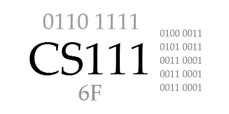

---  
*** draft ***
---  

# CS 111 Introduction to Computer Science   
**Fall 2026**
**Section 01**   

---

## Instructor Information

**Instructor:** Dr. Jeff Lehman  

See contact information on Moodle.

> **Privacy Note:**  
> Instructor contact information is not listed in this public syllabus to reduce spam and protect privacy.  
> All enrolled students can find current contact details and office hours on Moodle.

---

## Meeting Time & Location

**Monday, Wednesday, and Friday**  
**1:00–1:50 pm**  
**Science Hall 175/177**  

> Note: There are two doors to enter the classroom—175 (left) and 177 (right).

---

## Course Description

An introduction to fundamental computer concepts and terminology applicable for communication in 
today’s world. Topics include historical perspective, computer architecture, operating systems, 
networking, impact of computing on society and current application areas, including spreadsheets, 
web page development and use of a programming language. Programming topics include input/output, 
loops, decision structures, lists, and functions. Attention is given to good programming style and 
problem-solving techniques for program design, coding, documentation, debugging and testing. *(3 credit hours; fall/spring/summer)*

This course integrates computing concepts and Python programming to build data-oriented problem-solving skills, prepare students for future coding courses, and provide practical Python literacy for all majors. The course emphasizes mastery of core computing and programming competencies through repeated assessments, hands-on activities and projects that develop practical technology skills, and an integrated data project connecting data collection, spreadsheet analysis, web development, and Python programming.

---

## Learning Outcomes

Students will be able to:

1. Demonstrate an understanding of fundamental computer concepts, including historical perspectives, binary and hexadecimal numbers, computer architecture, operating systems, networking and the Internet, and artificial intelligence, enabling them to engage with today’s digital world effectively.
2. Use spreadsheets, web development tools, and programming to collect, organize, analyze, visualize, and communicate data.
3. Design, implement, and document simple programs using basic programming constructs, including input/output operations, loops, decision structures, lists, and functions.
4. Implement algorithms and apply problem-solving techniques, focusing on good programming style while performing effective debugging and testing to ensure code clarity and functionality.
5. Identify current ethical issues related to technology and the impact of computing on society, exploring how Christian values and Biblical insights apply.

---

## Required Texts and Resources

All required texts and readings are **available online at no cost**. Check the course website for weekly readings and links.

- (Free online textbook) ***Welcome to CS*** by Andrew Scholer  
  <https://runestone.academy/ns/books/published/welcomecs2/welcomecs.html?mode=browsing>

- (Website) **W3Schools**  
  <https://www.w3schools.com/>

- (Website) **GeeksforGeeks**  
  <https://www.geeksforgeeks.org/>

- (Optional print book)
  ***Computer Science Illuminated*** by Nell Dale and John Lewis (7th edition recommended; any edition acceptable). *Note: Most students find the online text, websites, and instructor materials sufficient. This book is helpful as a reference for the non-programming core competencies.*

---

## Grading

Each course component is worth a specific number of points. The percentage of total points determines the final grade. The instructor reserves the right to adjust assignments and points while maintaining overall percentage weightings.

### Summary of Course Grading

| Component                    |   Points |  Percent |
| ---------------------------- | -------: | -------: |
| Core Competencies            |      500 |      50% |
| Applied Projects             |      400 |      40% |
| Attendance and Participation |      100 |      10% |
| **Total**                    | **1000** | **100%** |

---

### Grading Scale

- **A:** 93.0+  
- **A-:** 90.0–92.9  
- **B+:** 88.0–89.9  
- **B:** 83.0–87.9  
- **B-:** 80.0–82.9  
- **C+:** 78.0–79.9  
- **C:** 73.0–77.9  
- **C-:** 70.0–72.9  
- **D+:** 68.0–69.9  
- **D:** 63.0–67.9  
- **D-:** 60.0–62.9  
- **F:** 0–59.9  

---

### Core Competencies

**Core Competencies:** The foundation of this course is a set of Core Competencies representing the essential computing concepts and programming skills students should understand and be able to demonstrate independently. These competencies include both general computing knowledge and fundamental Python programming skills. By the end of the course, successful students will have demonstrated their understanding across the following ten Core Competencies:

**Computing Concepts**

* **CC-01 – Data Representation:** Binary and hexadecimal numbers, character representation, file formats, and compression.
* **CC-02 – Computer Systems:** Logic, computer hardware, storage, processing, and basic computer architecture.
* **CC-03 – Operating Systems, Files, and Cloud Computing:** Operating system functions, file organization, local and cloud storage, and related concepts.
* **CC-04 – Networking and the Web:** Networking concepts, the Internet, web technologies, HTML, CSS, and web publishing.
* **CC-05 – Security and Privacy:** Cybersecurity threats, passwords, backups, privacy, responsible data collection, and protective practices.
* **CC-06 – Artificial Intelligence, Ethics, and Social Impact:** Artificial intelligence concepts, capabilities and limitations, ethical issues, societal impact, and Christian perspectives on technology.

**Python Programming**

* **PY-01 – Python Foundations:** Variables, data types, input, output, expressions, calculations, conversions, and formatted output.
* **PY-02 – Program Design, Implementation, Testing, and Debugging:** IPO planning, algorithms, program implementation, test cases, debugging, and code explanation.
* **PY-03 – Decisions and Repetition:** Boolean expressions, decision structures, `for` loops, `while` loops, and tracing program flow.
* **PY-04 – Lists and Functions:** Creating and processing lists and designing functions using parameters and return values.

Core Competencies are evaluated through scheduled assessments during the semester. You are expected to attempt each competency when it is initially scheduled and use feedback from earlier attempts to improve your understanding. Each competency may be **attempted up to three times**, with the highest score recorded.

If you miss a scheduled assessment without prior communication or approved arrangements, you will earn a zero for that attempt. Additional assessment opportunities will be provided during the semester, and the final exam period will serve as the final opportunity to reassess outstanding competencies. First attempts must be made during the semester; students should not plan to postpone competency assessments until the end of the course.

Competency assessments may include multiple-choice questions, calculations, code tracing, short-answer questions, code writing, debugging, and other problems that require students to demonstrate their own understanding. These assessments are completed individually without the use of artificial intelligence or other unauthorized assistance.

Each Core Competency is worth **50 points**, for a total of **500 points (50% of the course grade).**

---

### Applied Projects

**Applied Projects:** Applied Projects provide opportunities to use course concepts and skills in practical settings. Several projects are connected through a semester-long data theme in which students collect, organize, analyze, visualize, and communicate data using multiple computing tools. Other projects address important areas of computing that do not naturally fit within the data project.

Most project work will be completed during class with opportunities for instructor guidance, feedback, troubleshooting, and revision before the final submission. Projects are submitted once for grading, so students are expected to make effective use of class time and feedback while developing their work.

The Applied Projects include:

* **PROJECT-01 – Data Collection Design and Microsoft Form:** Design an appropriate data-collection topic and questions, consider privacy and data types, create a Microsoft Form, and collect a meaningful set of data.
* **PROJECT-02 – Spreadsheet Data Analysis and Visualization:** Organize and analyze collected data using spreadsheet formulas, functions, summary statistics, sorting or filtering, and appropriate graphs.
* **PROJECT-03 – Web Page Presenting Data and Results:** Create and publish a web page using HTML and CSS to communicate the purpose, results, and visualizations from the data project.
* **PROJECT-04 – Python Data Analysis and Visualization:** Use Python to process and analyze project data and create an appropriate visualization using a Python library such as Matplotlib.
* **PROJECT-05 – Technology Ethics Presentation:** Work with a small group to analyze and present a current ethical issue involving technology, including stakeholders, consequences, possible responses, and relevant Christian or Biblical perspectives.

Because the projects vary in scope and complexity, they are not all worth the same number of points.

| Applied Project                                          |  Points |
| -------------------------------------------------------- | ------: |
| PROJECT-01 – Data Collection Design and Microsoft Form   |      40 |
| PROJECT-02 – Spreadsheet Data Analysis and Visualization |      70 |
| PROJECT-03 – Web Page Presenting Data and Results        |      60 |
| PROJECT-04 – Python Data Analysis and Visualization      |     150 |
| PROJECT-05 – Technology Ethics Presentation              |      80 |
| **Applied Projects Total**                               | **400** |

Applied Projects are worth a total of **400 points (40% of the course grade).**

---

### Practice Activities

**Practice Activities:** Regular practice activities will help you develop the knowledge and skills needed for Core Competency assessments and Applied Projects. Most class meetings will include hands-on activities, problem solving, programming, discussion, pair work, or project development rather than extended lecture.

Practice activities may include binary and hexadecimal exercises, hardware and operating-system activities, networking and web exercises, spreadsheet work, Python programming practice, code tracing, debugging, testing, AI evaluation, and project preparation.

Practice activities are generally **not graded as separate assignments**. Their purpose is to provide opportunities to learn, practice, make mistakes, receive feedback, and prepare for competency assessments and projects. Students are strongly encouraged to complete all practice activities as they are introduced and to ask questions when concepts are unclear. Participation in in-class activities may contribute to the Attendance and Participation grade.

### Attendance and Participation

Because this course emphasizes hands-on activities, programming practice, discussion, and project development, regular attendance and active participation are important to success.

**Attendance (75 points):** Attendance is based on the percentage of scheduled class meetings attended. Attendance is recorded at the beginning of class. Students are expected to attend all class sessions, arrive on time, remain for the entire session, and use class time productively. Late arrivals, early departures, or extended time away from class may receive partial attendance credit.

If you arrive late or need to leave early, use the door opposite the instructor workstation in SH 175 and enter or leave quietly. Attending part of a class session is better than missing the entire session.

**Engagement (25 points):** Engagement reflects productive participation in the learning activities of the course. This includes completing in-class practice activities, participating appropriately in discussions and collaborative work, making reasonable progress on projects during designated class time, and using computers, phones, and other technology appropriately for course-related purposes. Students are not graded on how frequently they speak in class or whether they ask questions.

Attendance and Engagement grades will be updated regularly in Moodle to reflect each student's standing based on the portion of the course completed to that point.

Attendance and Participation are worth a total of **100 points (10% of the course grade).**

#### University Attendance Requirement

Huntington University policy requires students in a face-to-face course to attend at least two-thirds (2/3) of scheduled class sessions. **Students who miss one-third or more of the scheduled class meetings will automatically fail the course.** This total includes absences related to athletics, music, other university activities, or illness. Students remain responsible for course material and work missed during an absence.

Do not attend class if you are sick. Your health and the health of others come first. If you miss class, please contact Prof. Lehman and review the course materials in Moodle. Students who miss multiple sessions may be referred to Student Services, the Dean's Office, or the Registrar for additional support.

### Communication and Grades

Students are always encouraged to ask questions about course concepts, projects, assessments, or grades. The instructor will try to respond to messages within **24 hours on weekdays** and often much more quickly. Questions sent late at night or over the weekend may be answered on the next business day.

Grades will be posted in Moodle. Students are responsible for reviewing their grades regularly and reporting possible errors or discrepancies promptly.

### Submitting Work and Late Work

* Course work must be submitted through **Moodle** unless otherwise instructed.
* Applied Projects and other work with a stated submission deadline may be submitted up to **48 hours late with a 10% penalty** based on the total points available for that assignment, unless otherwise noted.
* Work submitted more than 48 hours after the deadline normally will not receive credit unless prior arrangements have been made or exceptional circumstances apply.
* Scheduled **Core Competency assessments follow the assessment and reassessment policies described elsewhere in the syllabus** rather than the general 48-hour late-work policy.
* In cases of significant hardship, illness, or other documented circumstances, students should contact the instructor as soon as reasonably possible. Appropriate arrangements will be considered based on the circumstances.

---

### Programming Tools

* **Python 3** will be used for programming activities and projects.
- **Thonny IDE** (recommended Python editor): <https://thonny.org/>  
- **Google Colab** (browser-based Python examples and practice): <https://colab.google/>  
- **GitHub** (web page hosting and course resource): <https://github.com/>

---

## Academic Honesty and Plagiarism

Academic integrity is essential. Students are expected to submit their own work and follow the collaboration and AI guidelines provided for each activity or project.

Academic dishonesty may include submitting work that is not your own, copying or sharing answers, failing to acknowledge sources, using AI or other resources when prohibited, or completing individual work collaboratively when collaboration has not been authorized.

Plagiarism is the use of another person's ideas, information, wording, or work without appropriate acknowledgment. Quoted, paraphrased, or summarized material must be cited when appropriate. Common knowledge does not require citation.

Some course activities and projects encourage collaboration, while Core Competency assessments and other designated work must be completed independently. Students are responsible for understanding the requirements for each activity.

Consequences for academic dishonesty may include loss of credit for the work, failure of the course, and referral to the Academic Dean in accordance with university policy.

---

## Artificial Intelligence (AI) Statement

This course permits the appropriate use of AI tools such as ChatGPT, Google Gemini, Microsoft Copilot, and Grammarly to support learning and development. Because understanding how to use and evaluate AI is itself an important computing skill, students will have opportunities to use AI thoughtfully throughout the course.

Students may use AI, when permitted, to:

* Understand or review course concepts
* Receive feedback on writing or ideas
* Debug and explain code
* Generate practice problems or examples
* Explore alternative approaches to a problem

Students remain responsible for all work they submit. You must understand, verify, and be able to explain any material or code produced with AI assistance.

**AI tools are not permitted during Core Competency assessments unless explicitly authorized by the instructor.** These assessments are designed to measure each student's independent understanding of course concepts and programming skills.

Course activities and projects may use the following AI guidelines:

* **Red:** AI use is not permitted.
* **Yellow:** AI use is permitted only for specified or limited purposes.
* **Green:** AI use is permitted throughout the activity, subject to the assignment requirements.

The AI designation and any additional requirements will be provided with each activity or project. Using AI outside the permitted guidelines, submitting AI-generated work without understanding it, or using AI to misrepresent your own knowledge or work may be considered academic dishonesty.

---

## Disability and Accessibility Policy

In compliance with Section 504 and the ADA, Huntington University provides reasonable accommodations.

Contact the **Academic Center for Excellence (ACE)**:  
- Phone: 260-359-4290  
- Email: ace@huntington.edu  

Faculty will work with ACE to support eligible students.

---

## Weekly Schedule

### Schedule and Core Competency Assessments

Core Competency assessments are completed individually and are designed to demonstrate your understanding of essential computing concepts and programming skills. Unless otherwise noted, assessments are **closed notes** and must be completed without AI or other unauthorized assistance.

Each Core Competency may be attempted up to **three times**, with the highest score recorded. Initial attempts are scheduled throughout the semester. Additional reassessment opportunities will be provided, and the Final Exam period will serve as the final opportunity to reassess outstanding competencies. Students should complete first attempts when scheduled rather than postponing assessments until the end of the semester.

The schedule below is a working plan. Topics, project deadlines, and assessment dates may change slightly based on class progress. Check Moodle for current information.

### Weekly Schedule

| Week       | M             | W                | F                | Computing / Data Focus                                                                | Python Focus                                                         | Project / Assessment Milestones                                                                                                                  |
| ---------- | ------------- | ---------------- | ---------------- | ------------------------------------------------------------------------------------- | -------------------------------------------------------------------- | ------------------------------------------------------------------------------------------------------------------------------------------------ |
| **1**      | 8/31          | 9/2              | 9/4              | Welcome; history and role of computing; introduction to data and the semester project | Python setup; output; simple programs                                | Introduce semester data project and examine sample data                                                                                          |
| **2**      | **Labor Day** | 9/9              | 9/11             | Binary and hexadecimal numbers                                                        | Variables, expressions, calculations                                 | Brainstorm possible data-collection topics                                                                                                       |
| **3**      | 9/14          | 9/16             | 9/18             | Data representation; ASCII; file formats; compression                                 | Input, data types, conversion, formatted output                      | Develop project topic, questions, data types, and privacy considerations                                                                         |
| **4**      | 9/21          | 9/23             | 9/25             | Logic and computer hardware                                                           | Boolean expressions; introduction to decisions; programming practice | **PROJECT-01: Data Collection Design and Microsoft Form**; begin collecting data                                                                 |
| **5**      | 9/28          | 9/30             | 10/2             | Operating systems, files, and cloud computing                                         | IPO program design; implementation, testing, and debugging           | **Core Competency Assessment #1:** Data Representation; Computer Systems; Python Foundations                                                     |
| **6**      | 10/5          | 10/7             | 10/9             | Spreadsheets; organizing and cleaning data; formulas and functions                    | Decisions and conditional processing                                 | Import collected data into spreadsheet; begin analysis                                                                                           |
| **7**      | 10/12         | 10/14            | 10/16            | Spreadsheet analysis, summary statistics, and visualization                           | Repetition: `for` and `while` loops                                  | **PROJECT-02: Spreadsheet Data Analysis and Visualization**; **Core Competency Assessment #2:** OS/Files/Cloud; Program Design/Testing/Debugging |
| **8**      | **Break**     | 10/21            | 10/23            | Networking, the Internet, and introduction to the Web                                 | Loop practice and integrated programming                             | Begin web presentation of project results                                                                                                        |
| **9**      | 10/26         | 10/28            | 10/30            | HTML, CSS, links, images, and web publishing                                          | Lists and processing collections of data                             | Develop and publish project web page                                                                                                             |
| **10**     | 11/2          | 11/4             | 11/6             | Security, privacy, passwords, backups, and responsible data practices                 | Functions, parameters, and return values                             | **PROJECT-03: Web Page Presenting Data and Results**; **Core Competency Assessment #3:** Networking/Web; Security/Privacy; Decisions/Repetition  |
| **11**     | 11/9          | 11/11            | 11/13            | Artificial intelligence: concepts, capabilities, limitations, and responsible use     | Lists and functions together; code explanation and debugging         | Introduce Technology Ethics Presentation                                                                                                         |
| **12**     | 11/16         | 11/18            | 11/20            | Ethical issues, social impact of computing, Christian and Biblical perspectives       | Reading CSV data from a provided template; analyzing project data    | **Core Competency Assessment #4:** AI/Ethics/Social Impact; begin Python data-analysis project                                                   |
| **13**     | 11/23         | **Thanksgiving** | **Thanksgiving** | Technology ethics presentations                                                       | —                                                                    | **PROJECT-05: Group Technology Ethics Presentation**                                                                                             |
| **14**     | 11/30         | 12/2             | 12/4             | Data visualization and communicating results                                          | Matplotlib; selecting and creating appropriate visualizations        | **Core Competency Assessment #5:** Lists and Functions; project development and reassessment                                                     |
| **15**     | 12/7          | 12/9             | 12/11            | Course synthesis; review; project completion                                          | Integrated Python data analysis and visualization                    | **PROJECT-04: Python Data Analysis and Visualization**; competency reassessment opportunities                                                    |
| **Finals** |               | **12/16**        |                  | **Final Assessment Period: Wednesday, December 16, 10:30 AM–12:30 PM**                |                                                                      | Final opportunity for Core Competency reassessments                                                                                              |

---

*Last modified: Thursday, January 9, 2026*

---
