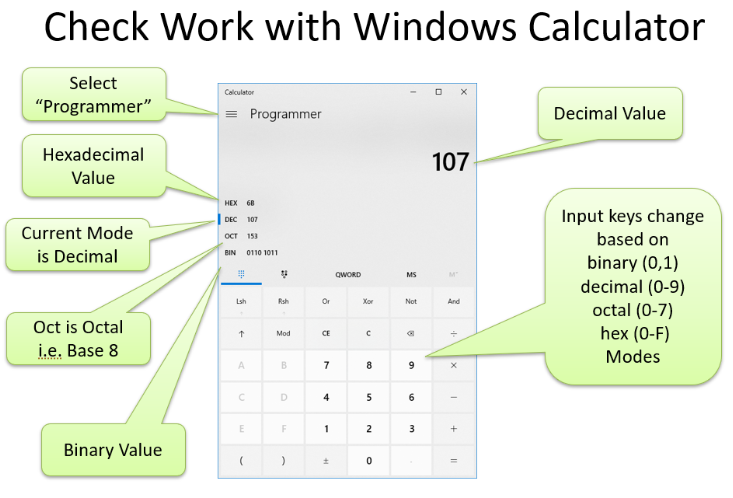
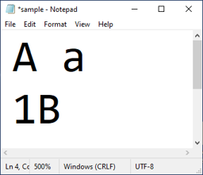
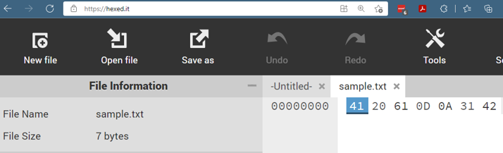

# Number Systems: Decimal, Binary and Hexadecimal

This resource reviews decimal, binary, and hexadecimal number systems and the conversions used in **CC-01 Data Representation**.

## Reading and Resources

- Read: [*Welcome to CS* - Chapter 3: Binary and Bits](https://runestone.academy/ns/books/published/welcomecs2/binary_binary-and-bits.html?mode=browsing)

- Read: [*Welcome to CS* - Chapter 4.1: Number Systems and Binary](https://runestone.academy/ns/books/published/welcomecs2/data-representation_number-systems-binary.html?mode=browsing)

- Read: [*Welcome to CS* - Chapter 4.2: Binary Conversions — Table Method](https://runestone.academy/ns/books/published/welcomecs2/data-representation_binary-conversions-table-method.html?mode=browsing)

- Read: [*Welcome to CS* - Chapter 4.11: Hexadecimal Numbers](https://runestone.academy/ns/books/published/welcomecs2/data-representation_hexadecimal.html?mode=browsing)

- Optional Video: [Sesame Street Counting](https://youtube.com/watch?v=HUL4T8WcFdA&pp=0gcJCf8Ao7VqN5tD)

---

## Decimal Number System

Humans commonly use the **decimal** number system.


*Humans have ten fingers and ten toes, one possible reason base 10 became the common decimal number system.*

- Decimal is a **base 10** number system.
- It uses ten symbols: `0, 1, 2, 3, 4, 5, 6, 7, 8, 9`.
- Each position represents a power of 10.


For example:

```text
decimal number:    2     4     3     7
place values:    1000   100    10     1
                  10^3  10^2   10^1   10^0
```

Therefore:

```text
2,437 = (2 × 1000) + (4 × 100) + (3 × 10) + (7 × 1)
```

### Quick Review

1. How many symbols are used in the decimal number system?
2. Decimal is a base-_____ number system.
3. In the decimal number `387`, what does the digit `8` represent?
4. In the decimal number `29`, what does the digit `9` represent?

---

## Binary Number System

The **binary** number system uses only two symbols:

`0` and `1`

Binary is a **base 2** number system. Each position represents a power of 2.

```text
binary number:      1    0    1    1
place values:       8    4    2    1
                    2^3  2^2  2^1  2^0
```

Therefore:

```text
1011 binary = 8 + 2 + 1 = 11 decimal
```

At the computer hardware level, binary values can be represented using two states, such as electricity **off/on**.

---

## Converting Binary to Decimal (place values method)

1. Write the binary place values below the digits. Start with `1` at the right and multiply by `2` as you move left. You can also start with 1 and double the value.

2. Add the place values below each `1` in the binary number. The sum of these place vlaues is the equivalent decimal value. 

### Example A

```text
binary number:    0   1   1   0     1   1   0   1
place values:   128  64  32  16     8   4   2   1
```

```text
0110 1101 binary = 64 + 32 + 8 + 4 + 1
                 = 109 decimal
```

### Example B

```text
binary number:    1   0   0   0     1   0   1   0
place values:   128  64  32  16     8   4   2   1
```

```text
1000 1010 binary = 128 + 8 + 2
                 = 138 decimal
```

>Notice that we separate each group of 4 bits with a space to make it easer to read e.g. `10101010` vs. `1010 1010` 

---

## Converting Decimal to Binary

Using the place-value subtraction method:

1. Find the largest binary place value that can be subtracted from the decimal number.
2. Subtract that value and mark the corresponding position with `1`.
3. Repeat until the remainder is zero.
4. Mark all unused positions with `0`.

### Example: Convert 43 Decimal to Binary

```text
binary digits:     0   0   1   0     1   0   1   1
place values:    128  64  32  16     8   4   2   1
```

```text
43 - 32 = 11
11 - 8  = 3
3 - 2   = 1
1 - 1   = 0
```

Therefore:

```text
43 decimal = 0010 1011 binary
```

Check:


```text
32 + 8 + 2 + 1 = 43
```

Adding the place values must total the decimal number.


### Another Example: Convert 134 Decimal to Binary

```text
binary digits:     1   0   0   0   0   1   1   0
place values:    128  64  32  16   8   4   2   1
```

```text
134 - 128 = 6
6 - 4     = 2
2 - 2     = 0
```

Therefore:

```text
134 decimal = 1000 0110 binary
```

Check:

```text
128 + 4 + 2 = 134
```

### Binary Review

1. How many symbols are used in the binary number system?
2. Binary is a base-_____ number system.
3. Fill in the missing binary place value: `128 64 32 16 ___ 4 2 1`.
4. What decimal value is represented by `0100` binary?

---

## Hexadecimal Number System

The **hexadecimal**, or **hex**, number system is **base 16**. It uses 16 symbols:

`0, 1, 2, 3, 4, 5, 6, 7, 8, 9, A, B, C, D, E, F`

The letters represent values greater than 9:

| Decimal | Hex | Binary |
|---:|:---:|:---:|
| 0 | 0 | 0000 |
| 1 | 1 | 0001 |
| 2 | 2 | 0010 |
| 3 | 3 | 0011 |
| 4 | 4 | 0100 |
| 5 | 5 | 0101 |
| 6 | 6 | 0110 |
| 7 | 7 | 0111 |
| 8 | 8 | 1000 |
| 9 | 9 | 1001 |
| 10 | A | 1010 |
| 11 | B | 1011 |
| 12 | C | 1100 |
| 13 | D | 1101 |
| 14 | E | 1110 |
| 15 | F | 1111 |

Hexadecimal also uses positional place values based on powers of 16:

```text
hex number:         0     1     A     4
place values:     4096   256    16     1
                   16^3  16^2   16^1   16^0
```

## Converting Hexadecimal to Decimal (place values method)

1. Write the hexadecimal place values below the digits. Start with `1` at the right and multiply by `16` as you move left.

2. Convert any hexadecimal letters to their decimal values (`A = 10`, `B = 11`, `C = 12`, `D = 13`, `E = 14`, `F = 15`).

3. Multiply each hexadecimal digit by its place value. Add the results to find the equivalent decimal value.

### Example A

```text
hex number:       6    D
place values:    16    1
```

```text
6D hex = (6 × 16) + (13 × 1)
       = 96 + 13
       = 109 decimal
```

### Example B

```text
hex number:       8    A
place values:    16    1
```

```text
8A hex = (8 × 16) + (10 × 1)
       = 128 + 10
       = 138 decimal
```

### Example C

```text
hex number:       2    3
place values:    16    1
```

```text
23 hex = (2 × 16) + (3 × 1)
       = 32 + 3
       = 35 decimal
```
>Notice that hex numbers do necessarily include sympbols A, B, C, D, E, or F


### Hex Review

1. How many symbols are used in hexadecimal?
2. Hexadecimal is a base-_____ number system.
3. Fill in the missing hexadecimal place value: `4096 ___ 16 1`.
4. What decimal value does the hex digit `C` represent?

---

## Hexadecimal and Binary

Hexadecimal provides a convenient shorthand for binary because **one hexadecimal digit represents exactly four binary digits (bits)**. 

The first four binary place values are:

```text
8 4 2 1
```

### Hex to Binary

Expand each hexadecimal digit into four binary digits.

```text
A hex = 1010 binary
```

We treat **each grouping of four bits as a separate number** thus the model is

```text
3A hex = 0011 1010 binary

binary model: 8 4 2 1   8 4 2 1
place values: 0 0 1 1   1 0 1 0

2 + 1 = 3, 8 + 2 = 10 (A)
```


Examples:

```text
B7 hex = 1011 0111 binary
6A hex = 0110 1010 binary
54 hex = 0101 0100 binary
F2 hex = 1111 0010 binary
```

### Binary to Hex

The same process can be used to convert binary to hex. Divide the binary number into groups of four bits and convert each group to one hexadecimal digit.

```text
8 4 2 1
1 0 0 0 binary = 8 hex
```

We treat **each grouping of four bits as a separate number** thus the model is

```text
binary model: 8 4 2 1   8 4 2 1
place values: 1 0 1 1   1 1 0 0 binary = BC hex

8 + 2 + 1 = 11 (B), 8 + 4 = 12 (C)
```


Examples:

```text
0101 0110 binary = 56 hex
0111 1011 binary = 7B hex
1101 1100 binary = DC hex
0001 1000 binary = 18 hex
```

>Computers rarely display data in binary, rather data is displayed in hex as only one symbol is used to represent four symbols e.g. `B4` is shorter than `1011 0100`


### Hex/Binary Review

1. Each hexadecimal digit represents how many binary digits?
2. Convert `A` hex to binary.
3. Convert `0011` binary to hexadecimal.
4. Convert `B7` hex to binary.
5. Convert `0111 1011` binary to hexadecimal.

---

## Checking Your Work

The Windows Calculator **Programmer** mode can display decimal, hexadecimal, octal, and binary representations of a number. Use it to **check your work after completing a conversion yourself**.



A useful approach is:

1. Open **Calculator** in Windows.
2. Choose **Programmer** mode.
3. Select the number system you want to enter (`DEC`, `HEX`, or `BIN`).
4. Enter the number and compare the equivalent values shown in the other number systems.

---

## Binary and Hexadecimal in Everyday Computing

Binary and hexadecimal values appear in many computing applications.

### RGB Colors

Graphics applications commonly use the **RGB color model**, specifying values for red, green, and blue. These values are often written in hexadecimal.

- Decimal RGB component values range from `0` to `255`.
- The equivalent hexadecimal range is `00` to `FF`.

For example, a six-digit hexadecimal color value is organized as:

```text
 Red        Green      Blue
 00 to FF   00 to FF   00 to FF  hex
 0 to 255   0 to 255   0 to 255  decimal
 ```

- HU Green is hex code `#033621` where Red is 03 hex (3 decimal), Green is 36 hex (54 decimal), and Blue is 21 hex (33 decimal)

See [W3Schools — Hexadecimal Colors](https://www.w3schools.com/colors/colors_hexadecimal.asp?#033621).

---

### Viewing File Contents in Hexadecimal

A **hex editor** can display the contents of a file as hexadecimal digits. Because each hexadecimal digit corresponds to four binary digits, hexadecimal provides a compact way to inspect the binary data stored in a file.

For example, if a small text file contains:

```text
A a
1B
```




A hex editor would display numeric codes representing the characters stored in the file. The original presentation gives these examples:

```text
space            = 32 hex
A                = 41 hex
carriage return  = 0D hex
line feed        = 0A hex
```

You can experiment with a free online hex editor at [HexEd.it](https://hexed.it/). Create your own small text file, open it in the editor, and compare the characters in the file with their hexadecimal values.



---

### Optional: Alternate Method for Converting Decimal to Another Base

Another way to convert a decimal integer to another base is repeated division:

1. Divide the decimal number by the new base.
2. Record the remainder.
3. Divide the quotient by the new base again.
4. Continue until the quotient is zero.
5. Read the remainders from bottom to top.

This method can be used with base 2, base 8, base 16, or other bases, but it is not required for CC-01. 
If you find this method easier, feel free to use it!

### Optional: Binary Arithmetic

Computers can add and subtract binary numbers. Binary addition follows these basic rules:

```text
0 + 0 = 0
0 + 1 = 1
1 + 0 = 1
1 + 1 = 10  (remember 10 binary is 2 decimal)
```

Addition Example:

```text
  0101
+ 0011
------
  1000
```
> 5 + 3 = 8

Subtraction Example:

```text
  0101
- 0011
------
  0010
```
> 5 - 3 = 2

Note: Binary arithmetic is not required for CC-01.

---
### Optional: For Fun

>There are **10 types of people in the world**, those who understand binary and those who don't

- [Binary Hopscotch — September 21, 2008, FoxTrot by Bill Amend](https://www.gocomics.com/foxtrot/2008/09/21)

- [Binary Sudoku - FoxTrot by Bill Amend](https://foxtrot.com/2025/11/16/binary-sudoku/)

>11 Cheers for Binary!

Numbers can be represented in any base. Another base occasinaly used by computer is base 8 called **Octal**. The base 8 model is 256 64 8 1. Assuming Oct for octal and Dec for decimal, the following is true:

> Oct 31 = Dec 25


---

## Review Answer Key

### Decimal Review

1. 10
2. 10
3. 8 tens
4. 9 ones

### Binary Review

1. 2
2. 2
3. 8
4. 4 decimal

### Hex Review

1. 16
2. 16
3. 256
4. 12 decimal

### Hex/Binary Review

1. 4
2. `1010`
3. `3`
4. `1011 0111`
5. `7B`

---


